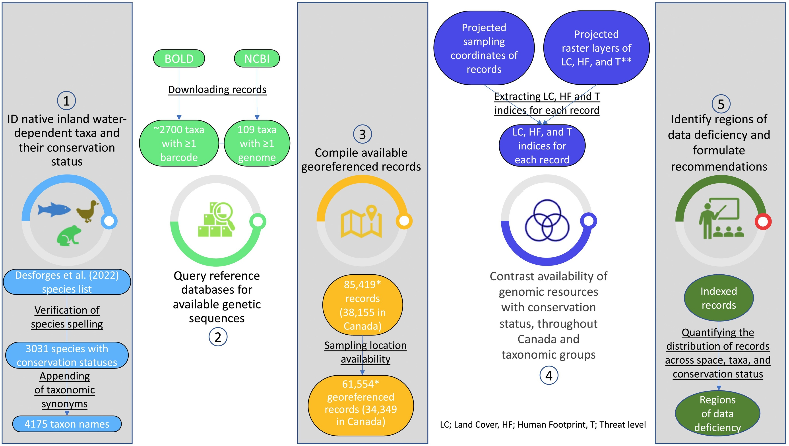

# FreshConservDNA

Scripts associated with the article

---

Monchamp M-E, Taranu ZE, Garner RE, Rehill T, Morissette O, Iversen LL, Fugère V, Littlefair JE, Barbosa da Costa N, Desforges JE, Sanchez Schacht JR, Derry AM, Cooke SJ, Barrett RDH, Walsh DA, Ragoussis I, Albert M, Cristescu ME, Gregory-Eaves I. 2023. Prioritizing taxa for genetic reference database development to advance inland water conservation. *Biological Conservation* **280**, 109963. https://doi.org/10.1016/j.biocon.2023.109963

---

## Scripts

- **00-palettes.R** Define colour palettes for figures in scripts 4 and 5.
- **01-curate_taxa.R** Curate taxon list from data published in Desforges *et al.* 2022.
- **02-download_bold.R** Download records from BOLD Systems.
- **03-download_ncbi_genome.R** Download records from NCBI Genome.
- **04-examine_bold_records.R** Explore downloaded BOLD Systems records.
- **05-examine_ncbi_genome_records.R** Explore NCBI Genome records.
- **06-make_figure_2.R** Plot Figure 2.
- **07-human_footprint.R** Map BOLD Systems records onto a human footprint index.
- **08-latitudinal_ranges.R** Estimate latitudinal spans of BOLD Systems records.
